# Hi there, I'm Krati Verma! 👋

  

---

<table>
  <tr>
    <td valign="top" width="55%">
      <h3>🚀 About Me</h3>
      

        I am a 3rd-year <strong>Computer Science and Engineering</strong> student at <strong>Sharda University Agra former Anand Engineering College</strong>, who believes in <strong>solving problems smartly</strong> — not just writing long code. I leverage <strong>AI & modern tools</strong> to build solutions that are fast, efficient, and actually useful. My focus is on <strong>impact over effort</strong> — getting things done the right way, in less time.
      

      <ul>
        <li>🥇 <strong>Hackathon Winner</strong>: Regularly participate in and win hackathons, successfully shipping functional prototypes under strict time constraints.</li>
        <li>🤝 <strong>Agile Team Player</strong>: Experienced in working in cross-functional developer teams, utilizing Git collaboration workflows, branch management, and peer PR reviews.</li>
        <li>🛡️ <strong>Cybersecurity Enthusiast</strong>: Familiar with network security fundamentals, traffic monitoring using Wireshark, network topology simulation via Cisco Packet Tracer, and working with secure Linux configurations.</li>
        <li>🎓 <strong>B.Tech CSE Student</strong>: Building real-world web apps, exploring advanced backend APIs, and web application security.</li>
      </ul>
       
      <!-- Connect Badges -->
      
      &nbsp;&nbsp;
      
    </td>
    <td valign="top" width="45%" align="center">
      
    </td>
  </tr>
</table>

---

### 📊 GitHub Activity

  
  &nbsp;&nbsp;
  

  

---

### 🛠️ Tech Stack & Skills

To keep my profile clean and high-impact, here are the core technologies I specialize in:

#### 💻 Languages & Frontend

 

#### ⚙️ Backend & Databases

 

#### 🛡️ Cybersecurity & Systems

  
  &nbsp;&nbsp;
  

 

#### 🛠️ Development Tools

---

### 📂 Featured Projects

Highlighting my actual code and live deployments so you can see my work directly:

| 🔍 [GitHub Analyzer](https://github.com/Krati-orbit/github-analyzer) | 🔒 [Red Box](https://github.com/Krati-orbit/red-box-app) |
| :--- | :--- |
| **Cognitive Developer Dashboard & Profiler** Built with React, TypeScript, and TailwindCSS. Uses Gemini AI to perform developer telemetry audits, score evaluations, and job matching. | **Secure Digital Will & Legacy Vault** Built with React, GSAP, and Firebase. Features AES-256 client-side encryption, Two-Factor Authentication (2FA), beneficiary management, and a Deadman's Switch check-in system. |
| 🔗 [Live Demo](https://github-analyzer-silk-two.vercel.app) \| [Code](https://github.com/Krati-orbit/github-analyzer) | 🔗 [Live Demo](https://red-boxx.web.app) \| [Code](https://github.com/Krati-orbit/red-box-app) |

| 🚨 [HackerAlert Bot](https://github.com/Krati-orbit/Hackeralert-Bot) | ⚖️ [LawBot 360](https://github.com/Krati-orbit/lawbot) |
| :--- | :--- |
| **Automated Vulnerability Monitoring & Alerting Bot** Built with Python. Parses threat feeds, monitors network activity, and dispatches real-time critical security alerts to Discord/Telegram webhooks. | **Your Personal Legal Assistant** Built with React and Firebase. Democratizes justice for every Indian by offering instant AI legal advice, document drafting (RTIs, FIRs), and IPC/BNS legal intelligence in regional languages. |
| 🔗 [Code](https://github.com/Krati-orbit/Hackeralert-Bot) | 🔗 [Live Demo](https://lawbot360.web.app/) \| [Code](https://github.com/Krati-orbit/lawbot) |

---

### 📊 GitHub Profile Overview

Instead of commit volume, my focus is on **writing clean, modular code** in modern web frameworks:

  
  &nbsp;&nbsp;
  

---

<!--
### 🎮 Anime Battle Arena
> Pick your fighter and play my custom interactive mini-game directly in your browser!

| 🍥 Naruto | 🏴‍☠️ Luffy | 👁️ Itachi | ⚡ Goku |
| :---: | :---: | :---: | :---: |
| **Rasengan Dodge** 🌪️ Dodge shurikens | **Gum Gum Punch** 🌊 Punch enemies | **Sharingan Aim** 🔴 Genjutsu clicks | **Kamehameha Blast** ☄️ Charge &amp; fire |
| [Play Naruto ↗](https://Krati-orbit.github.io/Krati-orbit/game.html?hero=naruto) | [Play Luffy ↗](https://Krati-orbit.github.io/Krati-orbit/game.html?hero=luffy) | [Play Itachi ↗](https://Krati-orbit.github.io/Krati-orbit/game.html?hero=itachi) | [Play Goku ↗](https://Krati-orbit.github.io/Krati-orbit/game.html?hero=goku) |

  

---
-->

### 🎵 Coding Soundtrack
Here's what I'm currently listening to on Spotify while building apps:

  

---

### 👾 Contribution Pac-Man
This retro board is compiled daily by a custom GitHub Action workflow, transforming my contributions into a game of Pac-Man:

  <picture>
    <source media="(prefers-color-scheme: dark)" srcset="https://raw.githubusercontent.com/Krati-orbit/Krati-orbit/output/pacman-contribution-graph-dark.svg?v=1">
    <source media="(prefers-color-scheme: light)" srcset="https://raw.githubusercontent.com/Krati-orbit/Krati-orbit/output/pacman-contribution-graph.svg?v=1">
    
  </picture>

  

